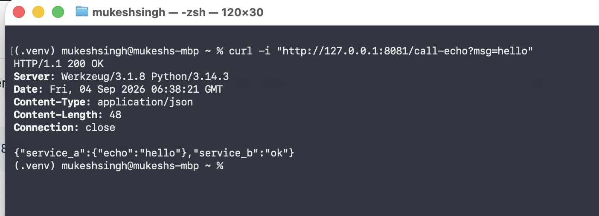
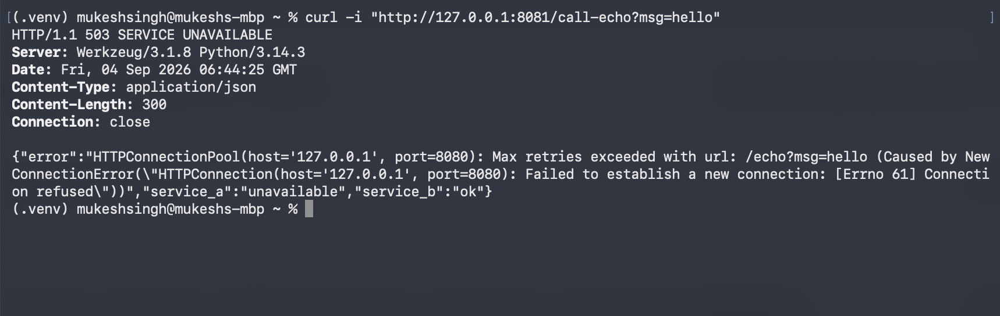

# CMPE 273 – Week 1 Lab 1: Your First Distributed System (Starter)

This starter provides two implementation tracks:

- `python-http/` (Flask + requests)
- `go-http/` (net/http)

Pick **one** track for Week 1.

## Lab Goal

Build **two services** that communicate over the network:

- **Service A** (port 8080): `/health`, `/echo?msg=...`
- **Service B** (port 8081): `/health`, `/call-echo?msg=...` calls Service A

### Minimum Requirements

- Two independent processes
- HTTP (or gRPC if you choose stretch)
- Basic logging per request (service name, endpoint, status, latency)
- Timeout handling in Service B
- Demonstrate independent failure (stop A; B returns 503 and logs error)

## Deliverables

1. Repo link
2. README updates:
   - How to run locally
   - Success + failure proof (curl output or screenshot)
   - 1 short paragraph: “What makes this distributed?”

# Python HTTP Implementation

## How to Run Locally

### Service A

Open a terminal(Terminal 1)  and run:

```bash
cd python-http/service-a
python3 -m venv .venv
source .venv/bin/activate
pip install -r requirements.txt
python app.py
```

Service A runs on:

`http://127.0.0.1:8080`


### Test Service A – `/health`

Open second terminal(Terminal 2)  and run:

```bash
curl "http://127.0.0.1:8080/health"
```

Expected result:

```json
{
  "status": "ok"
}
```

Logs:
```
2026-09-03 23:30:05,577 | SERVICE=A | ENDPOINT=/health | STATUS=200 | LATENCY_MS=0.000000000000
2026-09-03 23:30:05,578 | 127.0.0.1 - - [03/Sep/2026 23:30:05] "GET /health HTTP/1.1" 200 -
```


### Test Service A – `/echo`

```bash
curl "http://127.0.0.1:8080/echo?msg=hello"
```

Expected result:

```json
{
  "echo": "hello"
}
```

Logs
```
2026-09-03 23:32:52,484 | SERVICE=A | ENDPOINT=/echo | STATUS=200 | LATENCY_MS=0.000000000000
2026-09-03 23:32:52,484 | 127.0.0.1 - - [03/Sep/2026 23:32:52] "GET /echo?msg=hello HTTP/1.1" 200 -
````


### Service B

Open a third terminal(Terminal 3)  and run:

```bash
cd python-http/service-b
python3 -m venv .venv
source .venv/bin/activate
pip install -r requirements.txt
python app.py
```

Service B runs on:

`http://127.0.0.1:8081`


### Test Service B – `/health`

Open another terminal and run:

```bash
curl "http://127.0.0.1:8081/health"
```

Expected result:

```json
{
  "status": "ok"
}
```
Logs:
```
2026-09-03 23:36:25,872 | SERVICE=B | ENDPOINT=/health | STATUS=200 | LATENCY_MS=0.000000000000
2026-09-03 23:36:25,872 | 127.0.0.1 - - [03/Sep/2026 23:36:25] "GET /health HTTP/1.1" 200 -
```


## Service B successfully calls Service A through HTTP:

```bash
curl "http://127.0.0.1:8081/call-echo?msg=hello"
```

Expected result:

```json
{
  "service_a": {
    "echo": "hello"
  },
  "service_b": "ok"
}
```

Logs:
```
2026-09-03 23:41:52,088 | SERVICE=B | ENDPOINT=/call-echo | STATUS=200 | LATENCY_MS=8.000000000000
2026-09-03 23:41:52,088 | 127.0.0.1 - - [03/Sep/2026 23:41:52] "GET /call-echo?msg=hello HTTP/1.1" 200 -

--------------------------------------------------------------------
2026-09-03 23:41:52,086 | SERVICE=A | ENDPOINT=/echo | STATUS=200 | LATENCY_MS=0.000000000000
2026-09-03 23:41:52,086 | 127.0.0.1 - - [03/Sep/2026 23:41:52] "GET /echo?msg=hello HTTP/1.1" 200 -
```


### Screenshot



## Failure Proof

Service A was stopped while Service B continued running. Service B attempted to call Service A and returned HTTP `503 Service Unavailable`.

```bash
curl -i "http://127.0.0.1:8081/call-echo?msg=hello"
```

Expected result:

```text
HTTP/1.1 503 SERVICE UNAVAILABLE
```

Logs:
```
2026-09-03 23:44:25,758 | SERVICE=B | ENDPOINT=/call-echo | STATUS=503 | LATENCY_MS=2.000000000000
2026-09-03 23:44:25,759 | 127.0.0.1 - - [03/Sep/2026 23:44:25] "GET /call-echo?msg=hello HTTP/1.1" 503 -
```

### Screenshot


## What Makes This Distributed?

This is a distributed system because the application consists of two independent services running as separate processes. Service A and Service B communicate over HTTP using different network ports. Service B depends on Service A for the echo operation, but the services can run and fail independently. When Service A is unavailable, Service B remains running and handles the failure by returning HTTP 503.

# .gitignore

```gitignore
.venv/
__pycache__/
*.pyc
.DS_Store
```
